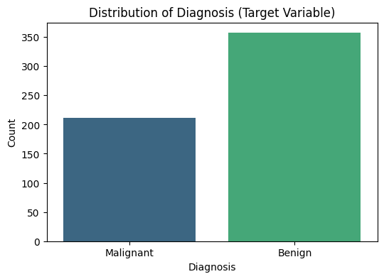
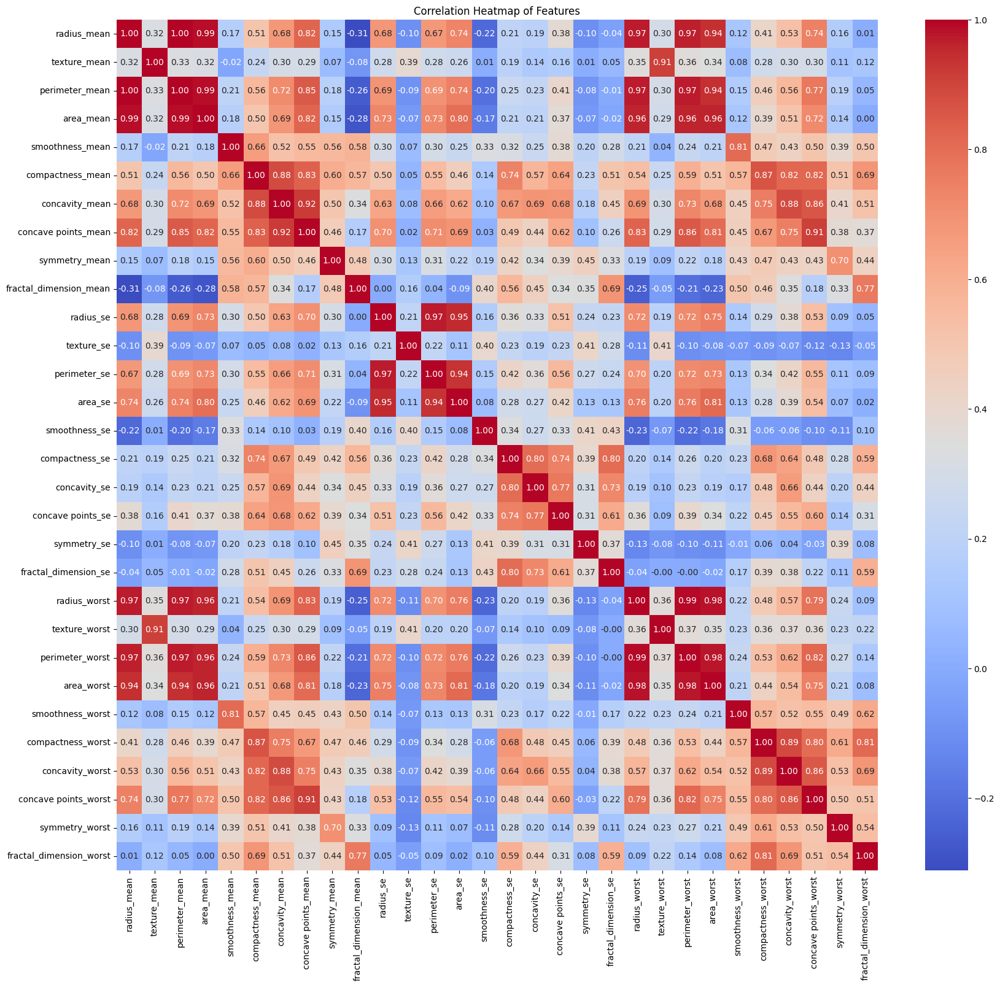
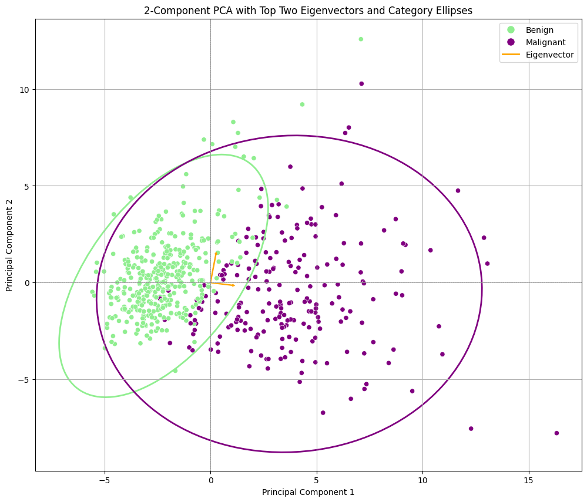
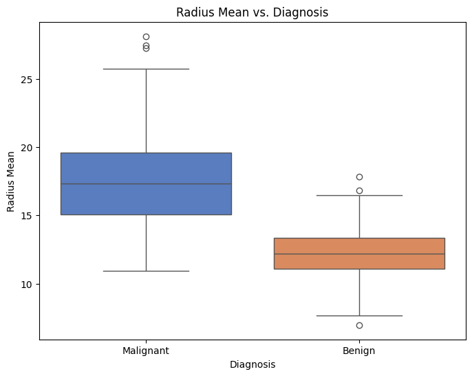

# Comparative Analysis of Machine Learning Algorithms for Breast Cancer Wisconsin Dataset

## Overview
This project builds and evaluates machine learning models to predict breast cancer from features extracted from digitized fine needle aspirate (FNA) images. The goal is to classify tumors as either **Benign** or **Malignant**.

## Dataset
The analysis uses the Breast Cancer Wisconsin (Diagnostic) dataset, which contains:

- 569 samples
- 30 real-valued features computed from digitized images
- an ID number for each sample
- a diagnosis label: `M = Malignant`, `B = Benign`

## Methodology
The analysis follows these main steps:

### 1. Data Loading & Inspection
- Load the dataset
- Check structure, data types, and missing values

### 2. Data Preprocessing
- Rename columns using the provided data dictionary
- Encode the `Diagnosis` target as numeric values (`M = 1`, `B = 0`)
- Scale numerical features with `StandardScaler`

### 3. Dimensionality Reduction
- Apply Principal Component Analysis (PCA) to retain 95% of the variance
- Create a 2-component PCA projection for visualization

### 4. Exploratory Data Analysis (EDA)
Visualizations were created to explore feature relationships and diagnosis patterns:

- Diagnosis distribution plot
- Correlation heatmap
- Radius mean comparison by diagnosis
- PCA visualization with eigenvectors and confidence ellipses

Saved visualizations are available in the `images/` folder:

- `images/correlation_heatmap.png`
- `images/diagnosis_distribution.png`
- `images/pca_eigenvectors.png`
- `images/radius_mean_diagnosis.png`

### 5. Data Splitting
- Split data into training (80%) and testing (20%) sets

## Models
The following classification algorithms were trained and evaluated:

- Logistic Regression
- K-Nearest Neighbors (KNN)
- Decision Tree Classifier
- Random Forest Classifier
- Support Vector Machine (SVM)

## Evaluation
Model performance was evaluated using:

- Accuracy
- Precision
- Recall
- F1-score
- Confusion matrices
- Training time comparisons

## Results
Logistic Regression achieved the best overall performance, indicating that the PCA-reduced dataset is well-suited to a linear classifier.

### Visualization Gallery
Below are the key visualizations generated in this project:

**diagnosis_distribution.png (Distribution of Diagnosis)**
- What it shows: This bar chart illustrates the count of each diagnosis category ('Benign' and 'Malignant') in the dataset.
- Insight: It helps understand the balance of the target variable. In this case, there are more 'Benign' cases than 'Malignant' cases, indicating class imbalance that may need to be addressed in advanced modeling.

**correlation_heatmap.png (Correlation Heatmap of Features)**
- What it shows: This heatmap visualizes Pearson correlation coefficients between all pairs of numerical features. Colors indicate the strength and direction of the correlation (warm colors for positive, cool colors for negative, intensity for strength).
- Insight: It helps identify highly correlated features. Strong correlations can indicate multicollinearity, which may be problematic for some models, and gives an initial sense of which features are related.

**pca_eigenvectors.png (2-Component PCA with Top Two Eigenvectors and Category Ellipses)**
- What it shows: This scatter plot displays data points reduced to two principal components (PC1 and PC2), colored by diagnosis. Overlaid arrows indicate the direction and magnitude of the original features' contribution to the principal components, and ellipses represent the 3-sigma confidence regions for each class.
- Insight: The plot visually confirms the separability of 'Benign' and 'Malignant' cases in reduced dimensionality space. Distinct clustering and separated ellipses suggest PCA is effective at making the classes more linearly separable, while eigenvectors show which features contribute most to the variance.

**radius_mean_diagnosis.png (Radius Mean vs. Diagnosis)**
- What it shows: This boxplot compares the distribution of the `radius_mean` feature for 'Benign' and 'Malignant' diagnoses.
- Insight: It helps determine whether `radius_mean` is a strong discriminator between the two classes. A clear separation in medians or non-overlapping interquartile ranges suggests `radius_mean` is an informative predictor for diagnosis.

### Confusion Matrices
Confusion matrices provide a detailed breakdown of classification performance by showing true positives (TP), true negatives (TN), false positives (FP), and false negatives (FN).

- What they show: Each matrix shows how often the model correctly or incorrectly classifies each class.
- Insight: They help evaluate model behavior beyond single metrics. For example, a high number of false positives means the model may be too aggressive predicting Malignant, while false negatives are more critical in medical diagnosis because they represent missed Malignant cases. Comparing confusion matrices across models reveals strengths and weaknesses beyond accuracy.

## Future Work
Potential improvements include:

- Implementing K-fold cross-validation for more reliable model evaluation
- Performing a deeper analysis of PCA loadings to understand feature importance
- Exploring additional feature engineering and model tuning

## Technologies Used
- Python
- Pandas
- NumPy
- scikit-learn
- Matplotlib
- Seaborn
